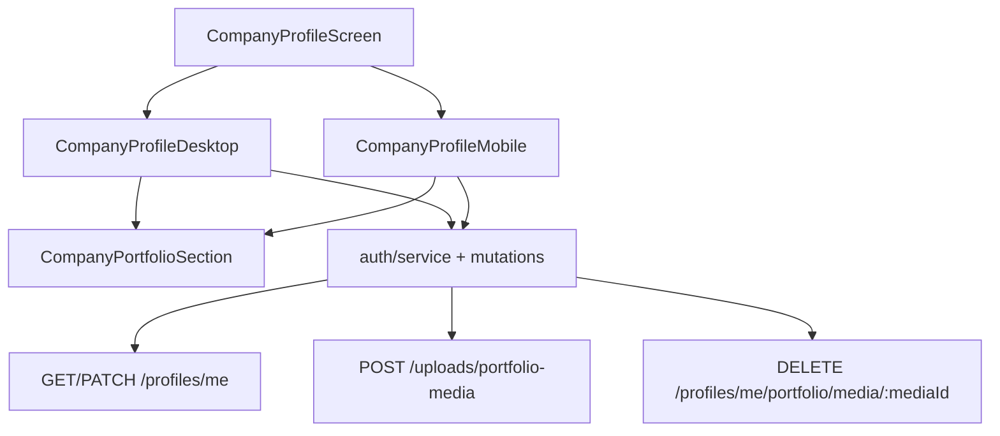

# Company Portfolio Media Design

**Spec**: `frontend/.specs/features/company-portfolio-media/spec.md`
**Status**: Approved

---

## Architecture Overview

O `CompanyProfileScreen` continua apenas como wrapper responsivo. A lógica de domínio do portfólio fica em um componente compartilhado que recebe a lista de mídias e callbacks de upload/remoção, enquanto desktop e mobile controlam apenas a composição visual para manter fidelidade ao layout do Figma.



## Code Reuse Analysis

### Existing Components to Leverage

| Component | Location | How to Use |
| --- | --- | --- |
| `useAuth` | `frontend/app/hooks/use-auth.ts` | Fonte única do usuário autenticado |
| `auth/service.ts` | `frontend/app/modules/auth/service.ts` | Adicionar serviços de upload e remoção |
| `auth/mutations.ts` | `frontend/app/modules/auth/mutations.ts` | Invalidar `authKeys.session()` após mudanças |
| `Button`, `Input`, `toast` | `frontend/app/components/ui/` | Reuso de UI base |

### Integration Points

| System | Integration Method |
| --- | --- |
| Auth session | Atualizar `BootstrapPayload` e `AuthUser` |
| Company form | Expandir schema com site e redes sociais |
| New backend portfolio API | Services e mutations dedicadas |

## Components

### CompanyPortfolioSection

- **Purpose**: Renderizar a seção `Portfólio & Mídia` e encapsular upload/remove com o contrato comum de mídia.
- **Location**: `frontend/app/modules/company-profile/components/company-portfolio-section.tsx`
- **Interfaces**:
  - `media: PortfolioMediaPayload[]`
  - `onUpload(file: File): Promise<void>`
  - `onRemove(mediaId: string): Promise<void>`
  - `isUploading?: boolean`
- **Dependencies**: `Button`, `toast`, `lucide-react`
- **Reuses**: Estilo e comportamento do layout Figma

### CompanyProfileDesktop / Mobile updates

- **Purpose**: Reorganizar campos para refletir o layout novo e usar o componente compartilhado do portfólio.
- **Location**: `frontend/app/modules/company-profile/components/`
- **Interfaces**: continuam recebendo `user: AuthUser`
- **Dependencies**: `react-hook-form`, mutations existentes e novas mutations de portfólio
- **Reuses**: fluxo atual de salvar perfil

## Data Models

### PortfolioMediaPayload

```ts
interface PortfolioMediaPayload {
  id: string;
  type: 'IMAGE' | 'VIDEO';
  url: string;
  thumbnailUrl?: string | null;
  sortOrder: number;
  status: 'PROCESSING' | 'READY' | 'FAILED';
}
```

### PortfolioPayload

```ts
interface PortfolioPayload {
  id: string;
  userId: string;
  media: PortfolioMediaPayload[];
  createdAt: string;
  updatedAt: string;
}
```

## Error Handling Strategy

| Error Scenario | Handling | User Impact |
| --- | --- | --- |
| Upload falha | `toast.error` | Usuário pode tentar novamente |
| Remoção falha | `toast.error` | Galeria permanece íntegra |
| Portfólio vazio | Estado vazio com CTA | Nenhum layout quebrado |
| Perfil sem dados sociais | Inputs vazios | Fluxo de edição normal |

## Tech Decisions

| Decision | Choice | Rationale |
| --- | --- | --- |
| Componente compartilhado | `CompanyPortfolioSection` | Evita duplicação de regra entre desktop e mobile |
| Invalidação | `authKeys.session()` | Já é o padrão do módulo de auth |
| Social fields | `websiteUrl`, `instagramUsername`, `tiktokUsername` | Alinhado ao layout enviado |
| Figma fidelity | Seguir spacing/radius/CTA dos frames enviados | Reuso com fidelidade visual suficiente sem MCP ativo |
